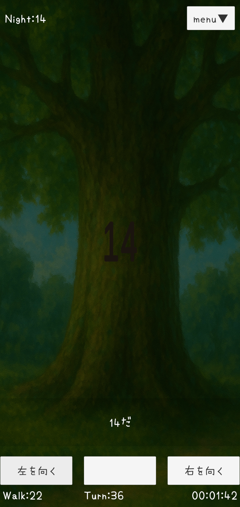
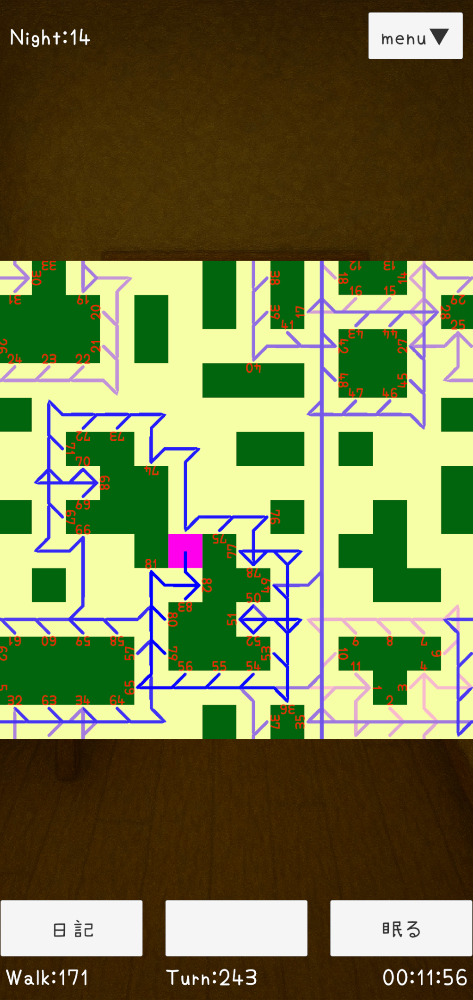
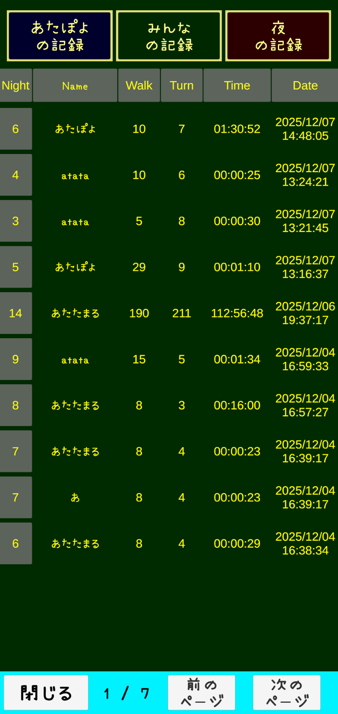

# Walk2

Walk2は、ランダム生成マップを探索して家に帰ることを目指す、軽量な探索ゲームです。
ランキング機能とオートセーブ機能を実装し、繰り返しプレイできる構成にしています。

---

## SS

---

## 配布ページ

- itch.io:https://atachan14.itch.io/walk2
- GitHub Releases:https://github.com/atachan14/Walk2.0/releases

Android端末向けにビルドしています。
PlayStore外で配布しているため、Androidの仕様上インストール時に警告が表示されます。

---

## ゲーム概要

- ランダム生成されたマップを探索し、家に帰ることを目指します
- 木のマスは通行できず、各方向から数字を書き込んで目印を残せます
- 家には特定の方向からしか入れないため、進行ルートを考える必要があります
- クリア後は通った道筋がリザルトとして表示されます
- 初回クリア後にランキング機能が解放され、他プレイヤーの記録を確認できます
- オートセーブにより進行状況を保持し、未クリアサイズのマップへ進めます

---

## 使用技術

- Unity（Unity 6系）
- Firebase
  - オンラインランキングの保存・取得
  - 進行状況のセーブ・ロード
- 対象プラットフォーム
  - Android
  - PC（Unity Editor上で動作確認）

---

## 設計・工夫点

- **完成を最優先**
  - 1か月程度で最後まで作り切ることを目標に設計しました。

- **ランキング機能の実装**
  - Firebaseを用い、ランキングが成立する構成にしています。
  - 不要な個人情報は保持しない設計です。

- **要件の割り切り**
  - チュートリアルを行わなくとも操作やゲーム性を理解できる形を目指しました。
  - 最初期は「川」と「橋」というギミックが存在していましたが、
    テストしてみるとプレイ体験を損ねるギミックだったため要件から外しました。

---

## 課題・今後の改善点

- 初見プレイヤーがゲーム性を本当に理解できるかは検証が不十分
- ゲーム性が想定以上に単調で、作業的
    - スマートフォンの画面幅を考慮し、可視化タイルは前方のみとしましたが、
      左右と前方斜めのタイルも可視化したほうが
      プレイに工夫の余地が生まれたかもしれません
- UI演出やフィードバックの強化

実装コストと完成度のバランスを取り、これらは未対応としました。

---

## 制作の目的

本作品は、個人制作で「設計 → 実装 → 公開」までを一通り経験することを目的に制作しました。
当初はPlayStoreでの公開と、友人に実際に遊んでもらうことを想定していましたが、
審査基準を満たすためのテスト体制を整えることが難しかったことに加え、
楽しんでプレイしてもらうには、ゲームのコアとなる体験そのものに課題があると判断したため、
最終的にはitch.ioで公開し、一区切りとしました。

